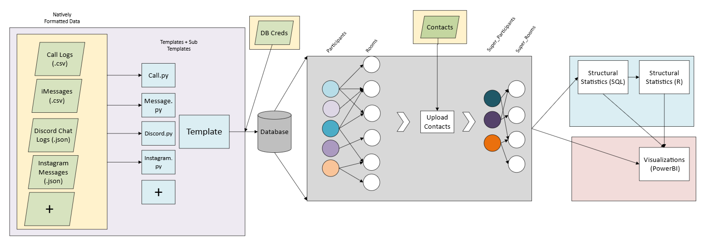

# CommBridge (Communication Data Pipeline + Structural Analysis)



### This python project serves to format and upload communication data from various platform and storage formats (iMessage, Instagram, Discord, Call Logs) into a consistent POSTGRESQL database structure designed for easy analysis in R, using a flexible Superclass template (4 sub templates includes)


# CommsBridge (For Communication Analysis)

## This Projects Serves To Format And Upload Various Communication Data Formats Into A Consistent Database Structure Designed For Easier Analysis, Specifically:

### This project contains a flexible communication database template, and a communication superclass template, that when implemented for a specific communication format (by setting several getters), uploads it seamlessly into a single database. Allowing various formats of communication (IE: "messages", "calls",  "InPlatform Media (IE: instagram reels)". "photos",) previously stored within various services (IE: "cell phone logs", "imessage", "instagram Messenger", "discord channels") to be formatted and brought into a single location, for text/communication analysis purposes

## Currently Included Format Templates Ive Implemented (see "file_types" folder):
- Instagram Messages    &emsp;&emsp;      (instagram.py)  &emsp;&emsp;  (.json, accessible: ["Instagram Internal Feature"](https://help.instagram.com/181231772500920?helpref=faq_content))
- Discord Channels/Chats  &emsp;&emsp;    (discord.py)    &emsp;&emsp;  (.json, accessible: ["External Export"](https://github.com/Tyrrrz/DiscordChatExporter))
- iMessage Conversations   &emsp;&emsp;   (message.py)  &emsp;&emsp;    (.csv, accessible: ["External_Export"](https://imazing.com/?gad_source=1&gclid=Cj0KCQiA4rK8BhD7ARIsAFe5LXI2fRIOXAeXx6rRsIZKdtzp7in7nZ4BfblS6rEu-z7QCjRuqnR6sf0aAoXMEALw_wcB))
- iPhone Call Logs:  &emsp;&emsp;&emsp;&emsp;&emsp; (added)


## Setup + Example Use:
### (This Demonstration Will Demonstrate Uploading All Your "Instagram Chats/GroupChats")
- Implement The POSTGRES DataBase "db_creation.sql", and store credentials in "db_creds.json"
- Determine The Desired Path To Your Data
    - Link to outer folder &emsp;&emsp;&emsp;&emsp;&emsp;&emsp;&emsp;&emsp; (will upload all subfiles matching a template),
    - Link to messages folder ".../inbox/" &emsp;&emsp; (upload all instagram template files within),
    - Link specific file IE: ".../message_1.json"  &emsp; (uploads that single chat)
- Run The Upload Command
```
python upload.py --path "your_file_folder_path"
```
- (Optional: In this case, we could have included --type "instagram" since all files within our folder would be same format type, however when not included, it will manually confirm each file)


## Implementing A Template: 
### (This Demonstrates The Template Setup For Uploading A "Discord Chat/Channel")
- Create The Template File (discord.py)
- Set Structural Values
```
        self.reply_type = template.CONNECT_ID               (since replies in are possible, and link message id)  
        self.outer_reaction_type = template.CONNECT_NA      (since reactions are within messages)
        self.inner_reactions =  True                        (since reactions are within messages)
        self.call_type =  template.CALL_SINGLE              (since the calls start and end are represented together)         
        self.chronological =  True                          (since the message data is in order of date)     
        self.multi_room =     False                         (since a discord chat contains a single room)
```
- Set Relevant Getters:
```
...
def get_participants(self):
        return {(message["author"]["name"], message["author"]["id"]) for message in self.comms}
...
def get_comm_media(self,comm):
        return [{"content":attach["url"], "location":None} for attach in comm["attachments"]]
...  
def get_inner_reactions(self,comm):
        return [{"content": reaction_symbol["emoji"]["name"], "participant": user["id"], "datetime": None}
                for reaction_symbol in comm["reactions"]
                for user in reaction_symbol["users"]]
...
```
- Add As A Template to "upload.py"
```
    from file_types.discord import discord

    type_list = {
        ....,
        "discord": discord,
    }

```


## Observed Differences Between Data

### Various Difficulties Include Differing (Existance/Representation):
- "replies" and "reactions" to messages
- Within platform media (IE: "Instagram Reel Within Instagram Text Channel")
- Communication structure changes (IE: "adding member to groupchat")
- "stickers", "gifs", "links", "photos", "videos"
- internal references between messages
- "calls" within a channel
- storage and removal of references of removed or deleted communication/media
